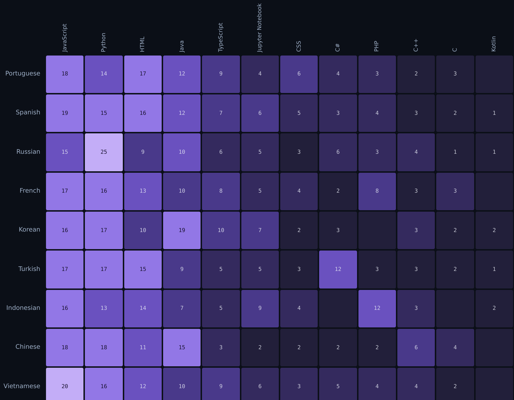
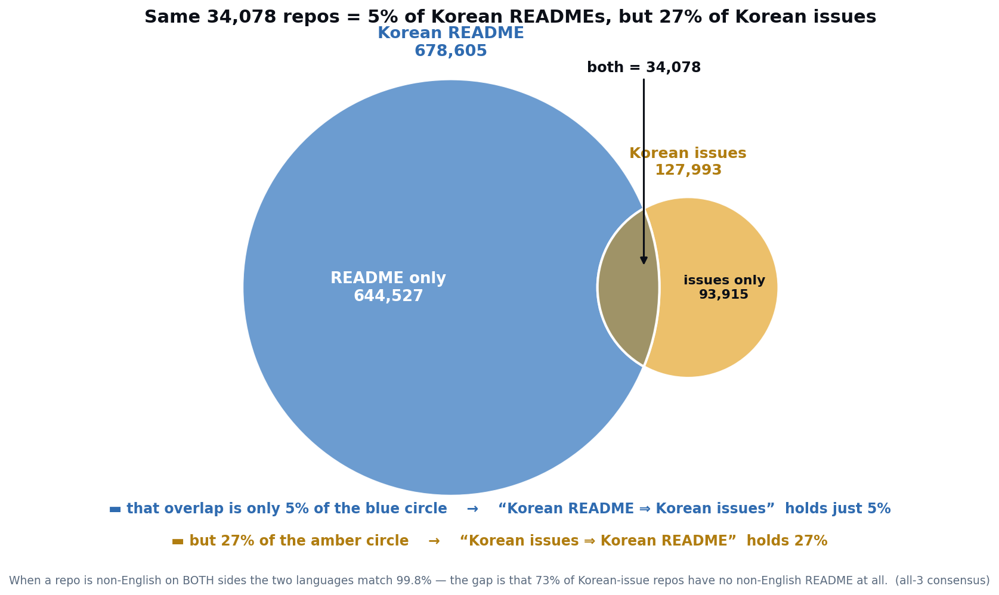

# multilingual-oss-map

[](LICENSE)
[](https://github.com/hyeonsangjeon/multilingual-oss-map/actions/workflows/deploy.yml)
[](https://github.com/hyeonsangjeon/multilingual-oss-map/stargazers)

**An interactive language map of multilingual open source.** Built from the public
[GitHub Multilingual Repositories Dataset](https://github.com/github/multilingual-repositories)
(CC0-1.0), it shows *what languages open source collaboration actually happens in* across 40M+
repositories.

The finding: many communities **discuss in their mother tongue even when their README isn't in it** —
the README is English, absent, or too short to classify.
The centrepiece is a choropleth **language map** of non‑English README, issue, and pull‑request
activity.

🌍 **[Live demo → hyeonsangjeon.github.io/multilingual-oss-map](https://hyeonsangjeon.github.io/multilingual-oss-map/)**

📝 **[Read the write-up → The README–Issue Language Gap in GitHub's 40-Million-Repo Dataset](https://medium.com/@wingnut0310/the-readme-issue-language-gap-in-githubs-40-million-repo-dataset-10227ce6772b)**

> ⚠️ This is a **language map, not a country map.** Colors mark regions where a language is commonly
> used — not where repositories are located. See [Data limitations](#data-limitations).
>
> *An independent, unofficial visualisation. Not affiliated with or endorsed by GitHub.*

[](https://hyeonsangjeon.github.io/multilingual-oss-map/)

<sub>↑ Pick a language and only its regions light up across the map — with a card reading out where it ranks in **READMEs vs issues vs pull requests** (classifier strictness: all‑3). Korean is 5th in READMEs but **1st in issues**.</sub>

## The question

> **Do developers write their docs in English, but talk in their mother tongue?**

According to the dataset, **Korean is the #1 non‑English language in issue text, but only #5 in
READMEs**, while **Portuguese is the #1 non‑English README language** (3M+ repositories). That gap
between *official documentation language* and *working conversation language* is the story this site
tells.

<p align="center">
  
  <br /><sub><em>Hovering South Korea (all‑3 strictness): Korean is <strong>5th in READMEs</strong>, but <strong>1st in issues</strong> and 2nd in pull requests.</em></sub>
</p>

## What you can explore

- **Language map** — a Natural‑Earth choropleth shaded by the top non‑English language per region,
  with a README / issue / pull‑request source switch (watch the map redraw). Click a language — on
  the map, the legend, or the ranking — to spotlight only its regions and read its cross‑source
  ranks in a description card.
- **Asymmetry chart** — a sortable dumbbell linking each language's README rank to its issue rank,
  with a **"where the asymmetry actually lives"** card: in repos classified in both sources the two
  languages match ~99.8 %, so the gap is compositional — repos with non‑English issues but *no
  non‑English README classification* (English, absent, or unclassifiable), not one repo switching
  registers.
- **Language detail** — per‑source counts and ranks, the classifier‑agreement split, primary
  repository languages, and star / fork quantiles for any language.
- **Growth over time** — repositories by creation year, by classified language.
- **Language × stack** — a natural‑language × programming‑language heatmap: for each language, the
  share of its repositories written primarily in each stack (Russian → Python, Korean → Java,
  Turkish → C#, Indonesian → PHP …), normalised per row so a large community can't dominate.
- **Method & limitations** — the constraints below, surfaced in the UI.

A **classifier‑strictness** dial (≥1 / 2‑of‑3 / all‑3, defaulting to **all‑3**) runs through every view as an honesty control.

<p align="center">
  
  <br /><sub><em>The asymmetry (dumbbell) chart at all‑3 — Korean makes the biggest jump: README <strong>5th</strong> → issue <strong>1st</strong>.</em></sub>
</p>

<p align="center">
  
  <br /><sub><em>Every language brings its own stack — within‑language share at all‑3. Russian leans <strong>Python</strong>, Korean <strong>Java</strong>, Turkish <strong>C#</strong>, Indonesian <strong>PHP</strong>.</em></sub>
</p>

## Design & decisions

Want the *why* behind the map, not just the *what*? Every non‑obvious call — the default
strictness, how English is handled, how repositories are counted — is logged with its rationale in
**[`docs/decisions.md`](docs/decisions.md)** (D1–D18). Three artifacts already in this repo answer
the questions readers ask most:

| Question | Answered by |
| --- | --- |
| **What does the map actually do?** | the [animated hero](docs/hero-loop.gif) at the top — pick a language, only its regions light up, with its README / issue / pull‑request ranks |
| **Where does the README↔issue asymmetry actually live?** | the [Korean README↔issue **Venn**](docs/venn-korean.png) below — why *5 %* and *99.8 %* aren't a contradiction |
| **Why *all‑3* by default? Why exclude English? Why count per (source × strictness)?** | the decision log **[`docs/decisions.md`](docs/decisions.md)** — see D9, D4, D5 |

<p align="center">
  
  <br /><sub><em>The same 34,078 repos are <strong>5 % of Korean READMEs but 27 % of Korean issues</strong>: the README circle is huge mostly because ~95 % of Korean‑README repos have <em>no classified issue at all</em>, so they can never enter the overlap — where README and issue languages agree ~100 %. Both fractions are correct; their denominators simply differ (all‑3 consensus; the mechanism behind <a href="#what-you-can-explore">the asymmetry chart</a>, detailed in <a href="docs/decisions.md">D18</a>; also <a href="docs/venn-chinese.png">Chinese</a>, <a href="docs/venn-japanese.png">Japanese</a>).</em></sub>
</p>

## What's here

| Path | Description |
| --- | --- |
| `scripts/aggregate.py` | DuckDB pipeline: turns 80M+ classification rows into small JSON |
| `site/` | Vanilla + Vite + D3 dashboard (choropleth map, slope chart, detail panel, timeseries, language×stack heatmap) |
| `site/data/*.json` | Committed aggregate outputs (a few hundred KB) |
| `docs/` | Schema notes, methodology, **design decisions** (`decisions.md`), language→region mapping, self‑check, progress |

## Data source

- **Dataset:** [GitHub Multilingual Repositories Dataset](https://github.com/github/multilingual-repositories)
- **Announcement:** [Accelerating researchers and developers building multilingual AI with a new open dataset](https://github.blog/ai-and-ml/llms/accelerating-researchers-and-developers-building-multilingual-ai-with-a-new-open-dataset/) — The GitHub Blog, 2026-06-15
- **License:** CC0-1.0 (public domain)
- **Scale:** 80,657,333 classification rows across 40,817,528 repositories
- **Classifiers:** fastText, gcld3, lingua-py (kept separate — see the strictness toggle)

## Reproduce

```bash
# 1. Download raw parquet shards (82 files, ~1.1 GB, git-ignored)
bash scripts/download_data.sh
# 2. Aggregate to site/data/*.json
python3 scripts/aggregate.py
# 3. Run the dashboard
cd site && npm install && npm run dev
```

Every number on the site is regenerated by `scripts/aggregate.py`; nothing is hand-entered.

## Data limitations

Language labels are inferred from the **first 150 characters** of a README / most-commented issue /
most-commented PR, and may capture badges, templates, install commands, or mixed-language text. This
dataset is **a discovery tool, not a ground-truth benchmark**, and must **not** be used to infer
attributes of the people behind repositories. All counts are "repositories **classified as** language
X", never "repositories that **use** language X". See [`docs/methodology.md`](docs/methodology.md).

---

⭐ **Star this repo if you find it useful — it helps others discover the dataset.**

📝 **Read the write-up:** [The README–Issue Language Gap in GitHub's 40-Million-Repo Dataset](https://medium.com/@wingnut0310/the-readme-issue-language-gap-in-githubs-40-million-repo-dataset-10227ce6772b) — how the map was built, why *all-3* is the default, and the finding that changed my mental model.

## License

Code: [MIT](LICENSE). Data: CC0-1.0, derived from the GitHub Multilingual Repositories Dataset.
