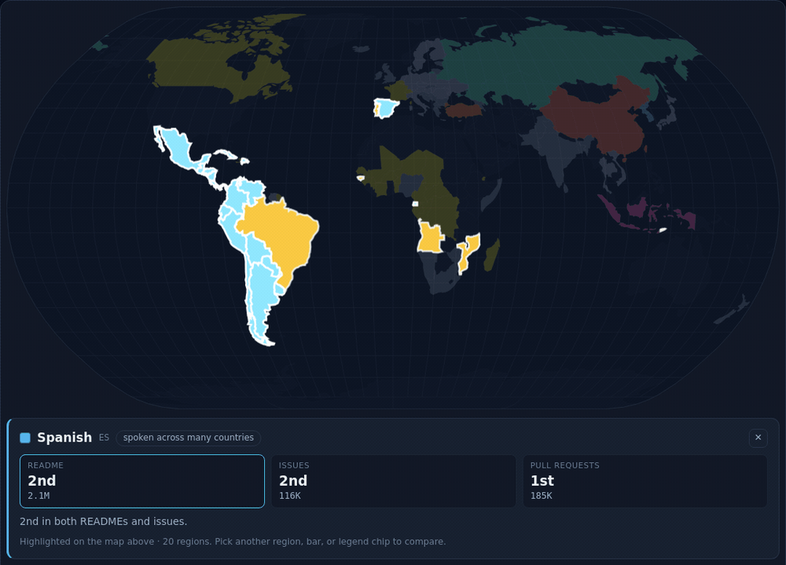
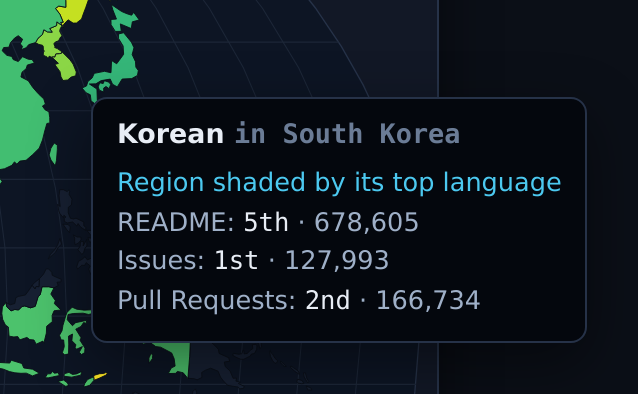
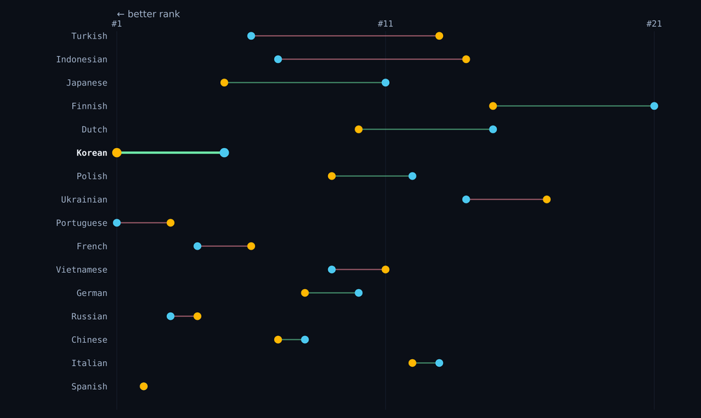

# multilingual-oss-map

[](LICENSE)
[](https://github.com/hyeonsangjeon/multilingual-oss-map/actions/workflows/deploy.yml)
[](https://github.com/hyeonsangjeon/multilingual-oss-map/stargazers)

**An interactive language map of multilingual open source.** Built from the public
[GitHub Multilingual Repositories Dataset](https://github.com/github/multilingual-repositories)
(CC0-1.0), it shows *what languages open source collaboration actually happens in* across 40M+
repositories.

The finding: many communities **write their README in English but discuss in their mother tongue.**
The centrepiece is a choropleth **language map** of non‑English README, issue, and pull‑request
activity.

🌍 **[Live demo → hyeonsangjeon.github.io/multilingual-oss-map](https://hyeonsangjeon.github.io/multilingual-oss-map/)**

> ⚠️ This is a **language map, not a country map.** Colors mark regions where a language is commonly
> used — not where repositories are located. See [Data limitations](#data-limitations).
>
> *An independent, unofficial visualisation. Not affiliated with or endorsed by GitHub.*

[](https://hyeonsangjeon.github.io/multilingual-oss-map/)

<sub>↑ The map recolours as the source switches **README → Issues → Pull Requests** (classifier strictness: all‑3). Portuguese leads READMEs; Korean leads issues.</sub>

## The question

> **Do developers write their docs in English, but talk in their mother tongue?**

According to the dataset, **Korean is the #1 non‑English language in issue text, but only #5 in
READMEs**, while **Portuguese is the #1 non‑English README language** (3M+ repositories). That gap
between *official documentation language* and *working conversation language* is the story this site
tells.

<p align="center">
  
  <br /><sub><em>Hovering South Korea (all‑3 strictness): Korean is <strong>5th in READMEs</strong>, but <strong>1st in issues</strong> and 2nd in pull requests.</em></sub>
</p>

## What you can explore

- **Language map** — a Natural‑Earth choropleth shaded by the top non‑English language per region,
  with a README / issue / pull‑request source switch (watch the map redraw).
- **Asymmetry chart** — a sortable dumbbell linking each language's README rank to its issue rank.
- **Language detail** — per‑source counts and ranks, the classifier‑agreement split, primary
  repository languages, and star / fork quantiles for any language.
- **Growth over time** — repositories by creation year, by classified language.
- **Method & limitations** — the constraints below, surfaced in the UI.

A **classifier‑strictness** dial (≥1 / 2‑of‑3 / all‑3, defaulting to **all‑3**) runs through every view as an honesty control.

<p align="center">
  
  <br /><sub><em>The asymmetry (dumbbell) chart at all‑3 — Korean makes the biggest jump: README <strong>5th</strong> → issue <strong>1st</strong>.</em></sub>
</p>

## What's here

| Path | Description |
| --- | --- |
| `scripts/aggregate.py` | DuckDB pipeline: turns 80M+ classification rows into small JSON |
| `site/` | Vanilla + Vite + D3 dashboard (choropleth map, slope chart, detail panel, timeseries) |
| `site/data/*.json` | Committed aggregate outputs (a few hundred KB) |
| `docs/` | Schema notes, methodology, language→region mapping, self‑check, progress |

## Data source

- **Dataset:** [GitHub Multilingual Repositories Dataset](https://github.com/github/multilingual-repositories)
- **License:** CC0-1.0 (public domain)
- **Scale:** 80,657,333 classification rows across 40,817,528 repositories
- **Classifiers:** fastText, gcld3, lingua-py (kept separate — see the strictness toggle)

## Reproduce

```bash
# 1. Download raw parquet shards (~1.1 GB, git-ignored)
bash scripts/download_data.sh
# 2. Aggregate to site/data/*.json
python3 scripts/aggregate.py
# 3. Run the dashboard
cd site && npm install && npm run dev
```

Every number on the site is regenerated by `scripts/aggregate.py`; nothing is hand-entered.

## Data limitations

Language labels are inferred from the **first 150 characters** of a README / most-commented issue /
most-commented PR, and may capture badges, templates, install commands, or mixed-language text. This
dataset is **a discovery tool, not a ground-truth benchmark**, and must **not** be used to infer
attributes of the people behind repositories. All counts are "repositories **classified as** language
X", never "repositories that **use** language X". See [`docs/methodology.md`](docs/methodology.md).

---

⭐ **Star this repo if you find it useful — it helps others discover the dataset.**

## License

Code: [MIT](LICENSE). Data: CC0-1.0, derived from the GitHub Multilingual Repositories Dataset.
